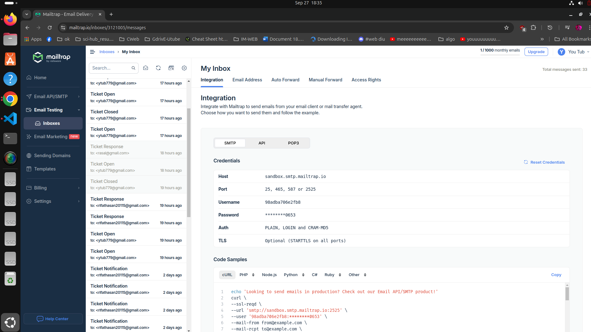
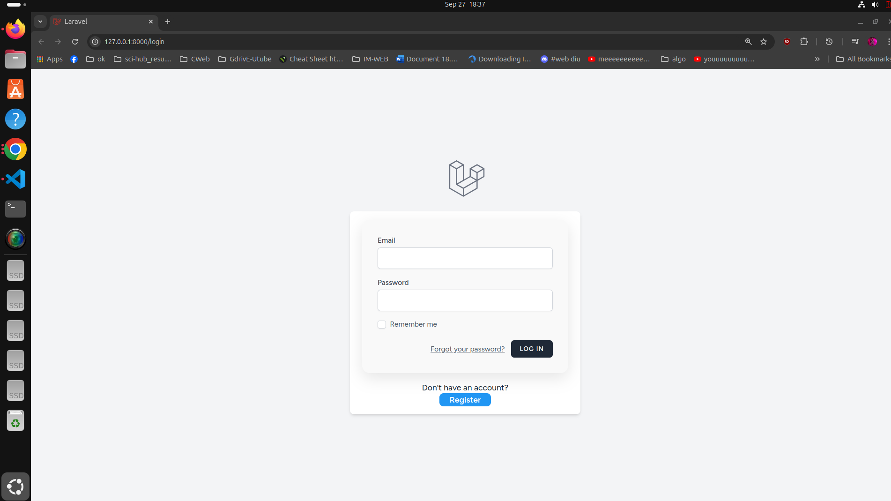
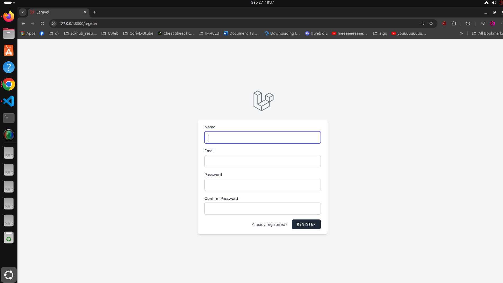
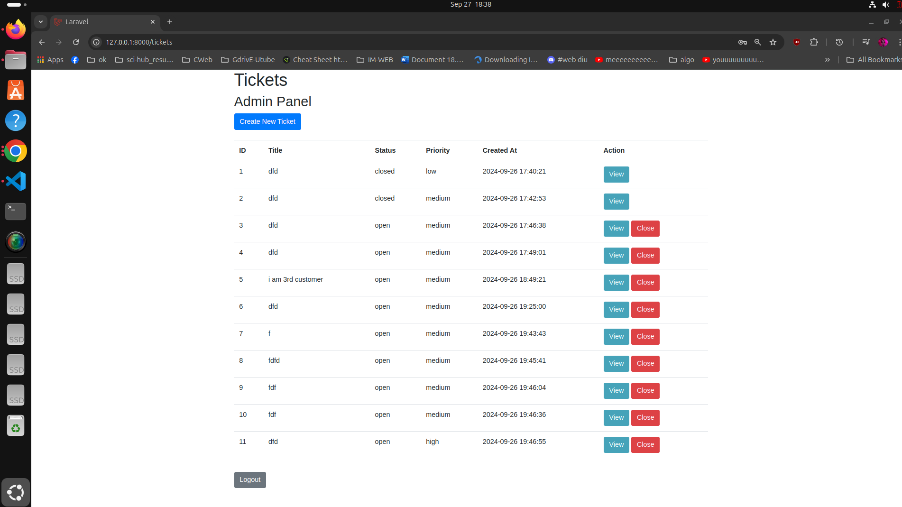
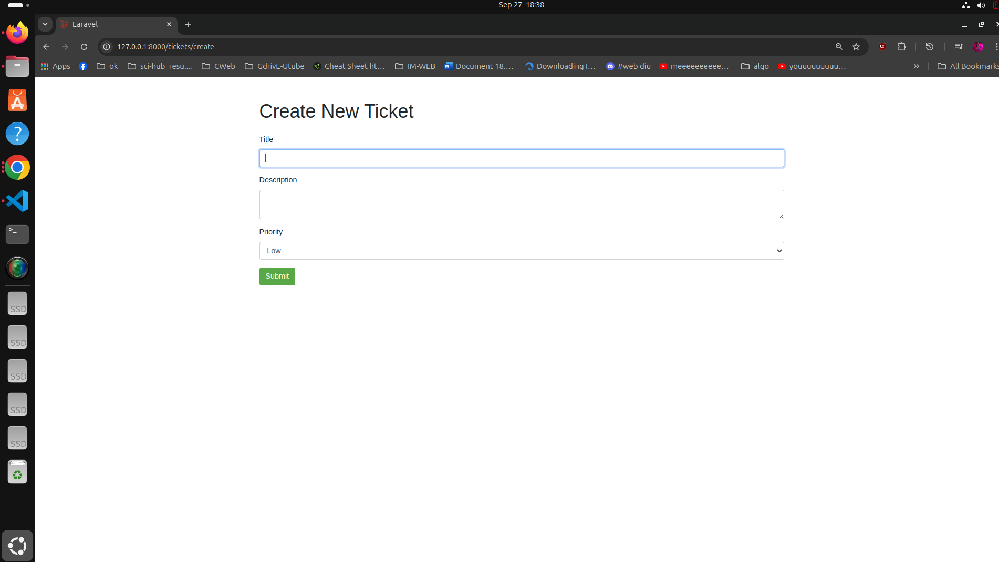
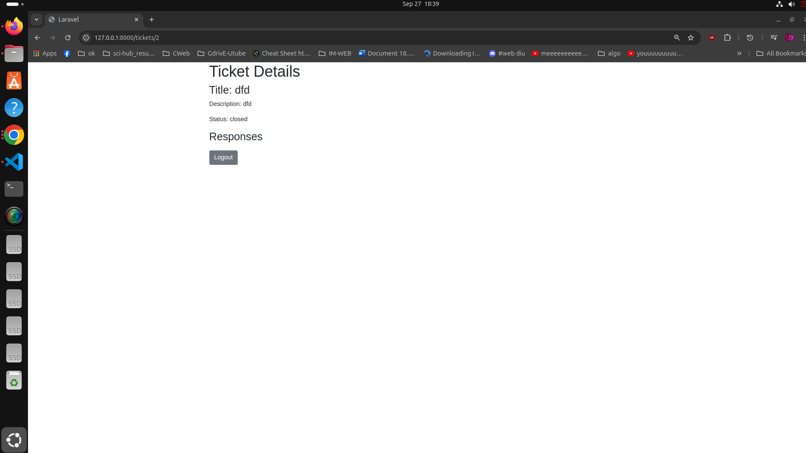
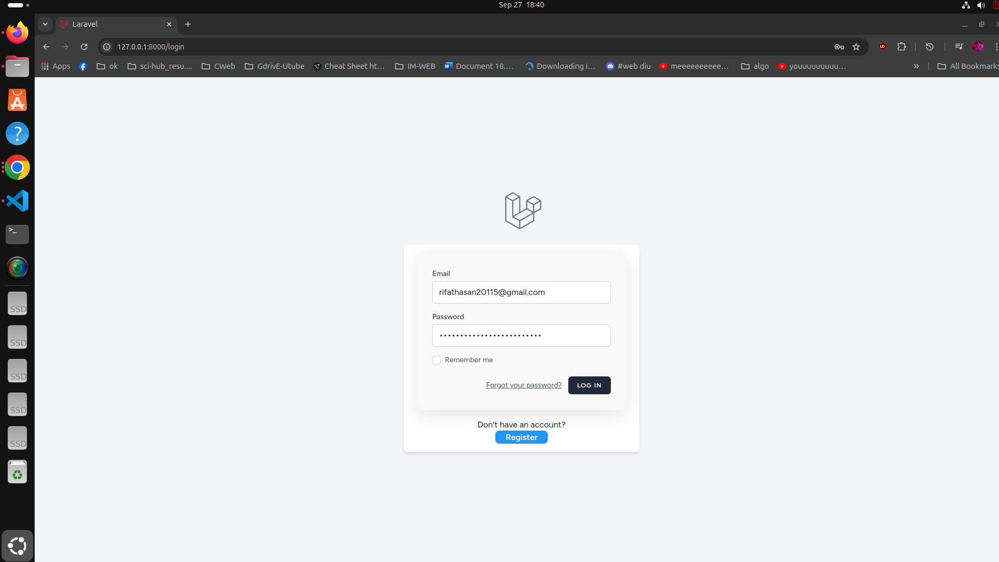
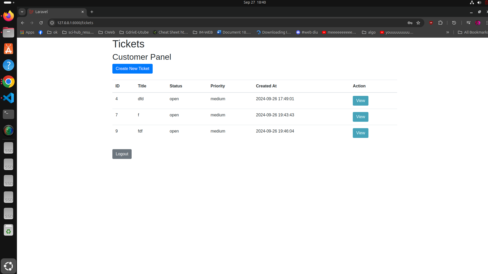
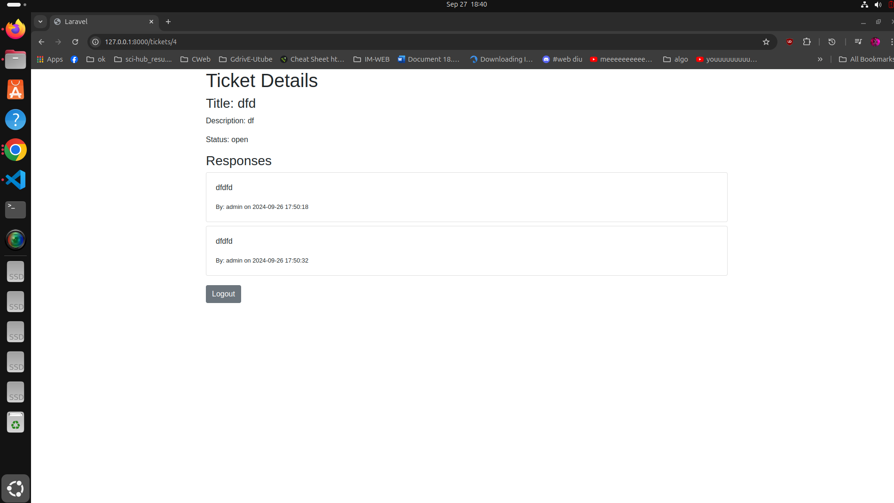
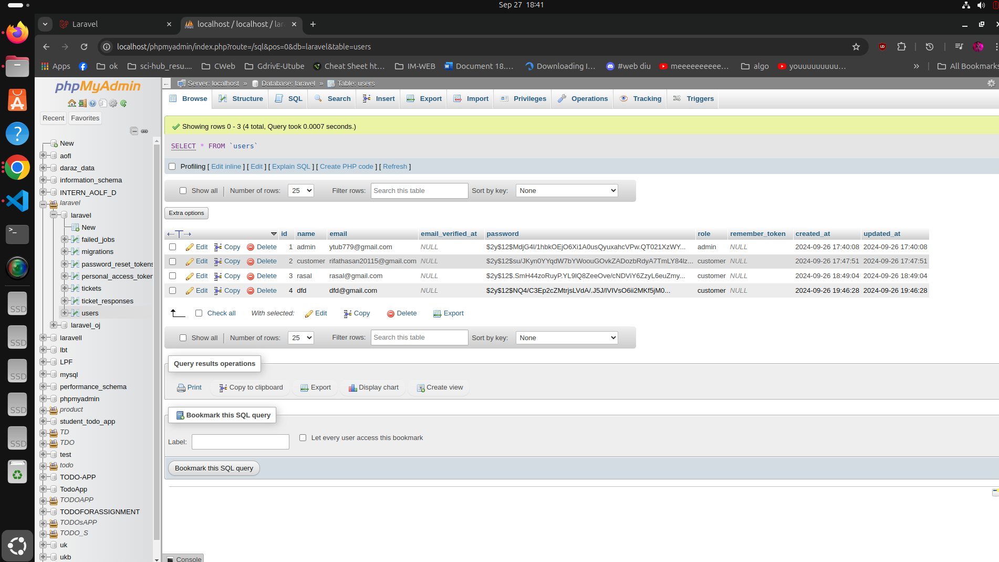

# Support Ticket Management System

This is a Laravel-based support ticket management system that allows users to create, manage, and track support tickets.

## Getting Started

Follow the instructions below to download, configure, and run the project on your local machine.

### Prerequisites

Ensure that you have the following software installed on your system:

- PHP 
- Composer
- npm
- Git
- MySQL (or any other supported database)

### Installation

1. **Clone the repository**

   Open your terminal and run the following command:

   git clone .......

Navigate to the project directory

cd support-ticket-coding-test

Install PHP dependencies

Run the following command to install the PHP dependencies:

composer install

Install JavaScript dependencies

Run the following command to install the necessary JavaScript dependencies:

npm install

Create a copy of the .env file

Copy the .env.example file to .env:

cp .env.example .env

Update the environment variables

Open the .env file in a text editor and update the following database and mail configuration:

dotenv

DB_CONNECTION=mysql
DB_HOST=127.0.0.1
DB_PORT=3306
DB_DATABASE=support_ticket
DB_USERNAME=root
DB_PASSWORD=yourpassword

MAIL_MAILER=smtp
MAIL_HOST=sandbox.smtp.mailtrap.io
MAIL_PORT=587
MAIL_USERNAME=9856bhdfg
MAIL_PASSWORD=f86gdfncvghfg
MAIL_ENCRYPTION=tls
MAIL_FROM_ADDRESS="rifathasan20115@gmail.com"
MAIL_FROM_NAME="${APP_NAME}"

Generate the application key

Run the following command to generate a unique application key:

php artisan key:generate

Run database migrations

Run the following command to create the necessary tables in your database:

    php artisan migrate

Running the Application

    Start the development server

    Run the following command to start the Laravel development server:

 

php artisan serve

This will start the application at http://127.0.0.1:8000.